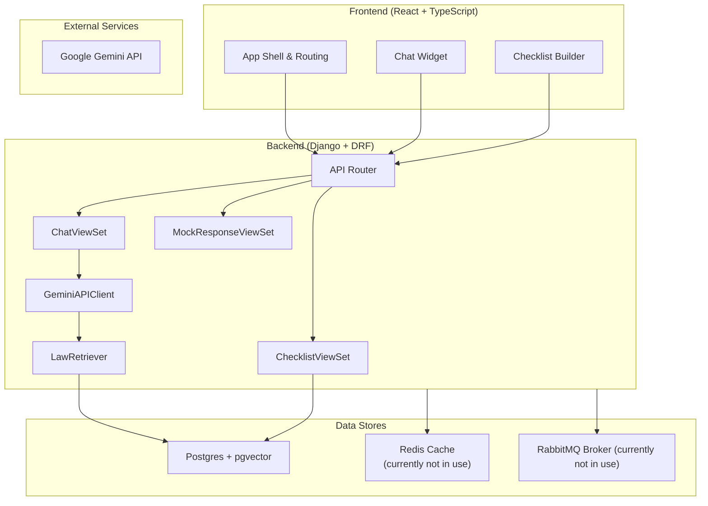
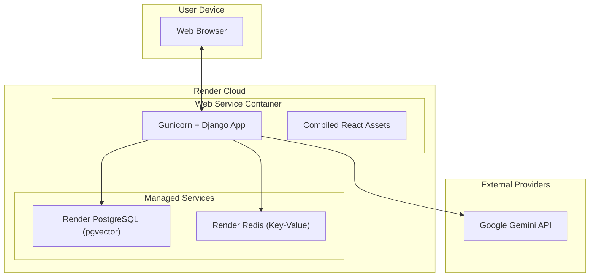
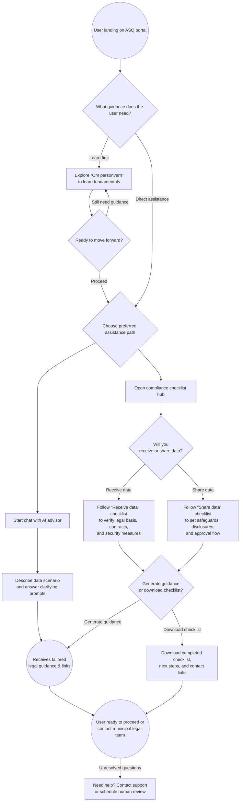

# ASQ: 4+1 Architectural View Model

## Logical View

```mermaid
classDiagram
    direction LR

    class User{ 
        <<actor>> User
        +authenticate()
        +navigate()
        +submitPrompt()
        +completeChecklist()
        +downloadGuidance()
    }

    class ReactApp{
        <<frontend>> 
        +render()
        +provideLayout()
        +useSidebar()
    }
    class AppRouter{
        <<frontend>>
        +configureRoutes()
        +guardPrivateRoutes()
    }
    class ChatPage{
        <<frontend>>
        +messages : ChatMessage[]
        +onSend()
        +displayHistory()
    }
    class ChecklistPage{
        <<frontend>>
        +collectContext()
        +submitChecklist()
        +downloadSummary()
    }
    class PrivacyPage{
        <<frontend>>
        +renderGuidance()
    }
    class DssChatBox{
        <<component>>
        +renderMessage(type, text)
    }
    class ChecklistForm{
        <<component>>
        +validateSections()
        +serializeSelections()
    }
    class ChatService{
        <<frontend_service>>
        +chatChatCreate(payload)
    }
    class ChecklistService{
        <<frontend_service>>
        +checklistCreate(payload)
        +checklistJsonToString(payload)
    }

    class DjangoApp{
        <<backend>>
        +urls
        +settings
        +celeryConfig
    }
    class MiddlewareStack{
        <<middleware>>
        +GZipMiddleware
        +SecurityMiddleware
        +PermissionsPolicyMiddleware
        +WhiteNoiseMiddleware
        +SessionMiddleware
        +CommonMiddleware
        +CsrfViewMiddleware
        +AuthenticationMiddleware
        +MessageMiddleware
        +XFrameOptionsMiddleware
        +CSPMiddleware
        +FailedLoginMiddleware
        +GuidMiddleware
    }
    class ApiRouter{
        <<backend>>
        +chatEndpoint : POST /api/chat/chat/
        +checklistEndpoint : POST /api/checklist/
        +jsonToStringEndpoint : POST /api/checklist/json-to-string/
        +mockEndpoint : POST /api/mock/fetch-by-keyword/
        +restCheckEndpoint : GET /api/rest/rest-check/
    }
    class ChatViewSet {
        +chat_api_view(prompt, history)
    }
    class ChecklistViewSet {
        +create(result)
        +json_to_string(data)
    }
    class MockResponseViewSet {
        +fetch_by_keyword(input)
    }
    class RestViewSet {
        +rest_check()
    }
    class GeminiAPIClient {
        +send_question_with_laws(prompt, history, context)
        +async_send_chat_message(...)
    }
    class LawRetriever {
        +retrieve(prompt, k_laws, k_paragraphs)
        -_retrieve_laws()
        -_retrieve_paragraphs()
        -_clean_text()
    }
    class ChecklistResult {
        +result : Text
    }
    class MockResponse {
        +response : Text
    }
    class UserModel {
        +email : EmailField
        +is_staff : Bool
        +is_active : Bool
    }
    class PgVectorStore{
        <<database>>
        +laws
        +paragraphs
        +vectorEmbeddings
    }
    class RedisCache{
        <<infrastructure>>
        +sessionData
        +celeryResults
    }
    class RabbitMQBroker{
        <<infrastructure>>
        +taskQueue
    }
    class CeleryWorker{
        <<backend>>
        +processBackgroundTasks()
    }
    class GeminiAPI{
        <<external>>
        +generateContent()
        +chat()
    }

    User --> ReactApp : interact
    ReactApp --> AppRouter : renderRoutes
    AppRouter --> ChatPage
    AppRouter --> ChecklistPage
    AppRouter --> PrivacyPage
    ChatPage --> DssChatBox : use
    ChatPage --> ChatService : invoke
    ChecklistPage --> ChecklistForm
    ChecklistPage --> ChecklistService : submit

    ChatService ..> ApiRouter : REST calls
    ChecklistService ..> ApiRouter

    ApiRouter --> ChatViewSet
    ApiRouter --> ChecklistViewSet
    ApiRouter --> MockResponseViewSet
    ApiRouter --> RestViewSet

    MiddlewareStack --> DjangoApp : wrapsRequests
    DjangoApp --> ApiRouter : includeUrls
    DjangoApp --> CeleryWorker : configure
    DjangoApp --> UserModel : auth

    ChatViewSet --> GeminiAPIClient : delegates
    GeminiAPIClient --> LawRetriever : fetchContext
    LawRetriever --> PgVectorStore : vectorSearch
    ChecklistViewSet --> ChecklistResult : persist
    MockResponseViewSet --> MockResponse : read

    CeleryWorker --> RabbitMQBroker : consumeTasks
    CeleryWorker --> RedisCache : storeResults
    DjangoApp --> RedisCache : cacheSessions
    DjangoApp --> RabbitMQBroker : enqueueTasks
    DjangoApp --> PgVectorStore : readWrite

    GeminiAPIClient ..> GeminiAPI : externalCall
```


```mermaid
stateDiagram-v2
    [*] --> Landing
    Landing : User arrives on portal dashboard
    Landing --> Learning : Chooses "Om personvern"
    Learning --> Landing : Returns to dashboard
    Landing --> DecidePath
    Chatting --> Reviewing : Reads answer & law links
    DecidePath --> ChecklistIntro : Opens compliance checklist hub
    ChecklistIntro --> ChecklistReceive : Selects "Receive data"
    ChecklistIntro --> ChecklistShare : Selects "Share data"
    ChecklistReview : Generates guidance/downloads
    ChecklistShare --> ChecklistReview : Fill out checklist form
    ChecklistReceive --> ChecklistReview : Fill out checklist form
    ChecklistReview --> WrapUp : Selects download
    ChecklistReview --> Chatting : Generate guidance
    DecidePath : Decide between chat or checklist
    DecidePath --> Chatting : Select chat advisor
    Reviewing --> Chatting : Ask follow-up
    Reviewing --> Support : Unresolved issues
    Support --> WrapUp : Escalate to legal team
    WrapUp --> [*]

## Process View
```mermaid
sequenceDiagram
    participant U as User
    participant UI as React Chat Widget
    participant API as Django REST Endpoint
    participant Chat as ChatViewSet
    participant GeminiSvc as GeminiAPIClient
    participant Retriever as LawRetriever
    participant Embed as FastEmbed Model
    participant DB as Postgres (pgvector)
    participant Gemini as Google Gemini API

    U->>UI: Type question & submit
    UI->>API: POST /api/chat {prompt, history}
    API->>Chat: Validate payload
    Chat->>GeminiSvc: send_question_with_laws(prompt, history)
    GeminiSvc->>Retriever: retrieve(prompt)
    Retriever->>Embed: generate embedding(prompt)
    Embed-->>Retriever: prompt embedding vector
    Retriever->>DB: vector similarity search
    DB-->>Retriever: relevant laws & paragraphs
    Retriever-->>GeminiSvc: contextual excerpts
    GeminiSvc->>Gemini: Send chat turn + context
    Gemini-->>GeminiSvc: Response text
    GeminiSvc-->>Chat: Formatted answer + history
    Chat-->>API: HTTP 200 {response, history}
    API-->>UI: JSON response
    UI-->>U: Render answer & citations
```

## Development View


## Physical View


## Scenario View
User-centric navigation of the DSS


